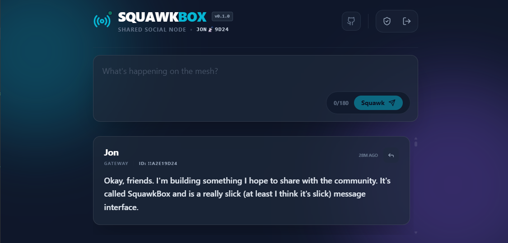

# 📡 SquawkBox

**SquawkBox** is a self-hostable "Social Gateway" for Meshtastic, bridging web-authenticated users to a shared LoRa node over TCP. Built with a premium, glassmorphic feed, real-time threaded replies, and native mesh telemetry support.



---

## ✨ Features

- **Physical Hardware Integration:** Native TCP connection to Meshtastic LoRa nodes using official `@meshtastic/core`.
- **Social Feed:** A premium, real-time "Twitter-style" feed for mesh traffic.
- **Native Meshtastic Threading:** Replies are sent as native protobuf packets, visible as organized threads on official Meshtastic mobile apps.
- **Hardened Authentication:** Production-grade HTTP-only cookie-based authentication with admin-controlled user approvals.
- **Live Mesh Telemetry:** Real-time SNR, RSSI, and Hop counts for every incoming message.
- **Identity Synthesis:** Automatic translation of hexadecimal Node IDs into human-readable Long Names.

---

## 🚀 Quick Start (Docker Compose)

The fastest way to deploy SquawkBox is using Docker.

### 1. Clone the Repository
```bash
git clone https://github.com/jonrick/squawkbox.git
cd squawkbox
```

### 2. Configure Environment
Create a `.env` file in the root directory (using `.env.example` as a template).

```bash
# Meshtastic Hardware Connection
MESHTASTIC_IP=192.168.1.100           # IP of your Meshtastic node
MESHTASTIC_PORT=4403                   # Typically 4403 for TCP
GATEWAY_NODE_ID=!a1b23c45              # Your Gateway Node ID (Hex)
MESHTASTIC_CHANNEL=0                   # Default broadcast channel (0 = Primary)

# Security
JWT_SECRET=your_super_secret_key_here  # Change this!
DATABASE_URL=file:./prisma/dev.db      # SQLite location
```

### 3. Launch
```bash
docker-compose up -d --build
```
SquawkBox will be available at `http://localhost:3000`.

---

## 🛠️ Local Development (Manual Setup)

### Backend (Fastify + Prisma)
```bash
cd backend
npm install
npx prisma db push
npm run dev
```

### Frontend (Next.js + Tailwind)
```bash
cd frontend
npm install
npm run dev
```

---

## 🤝 Contributing

We love contributions! SquawkBox is built with:
- **Frontend:** Next.js 14, Tailwind CSS, Lucide Icons, Socket.io-client.
- **Backend:** Fastify, Prisma (SQLite), @meshtastic/core, Socket.io.

### How to Contribute
1. **Fork** the repository.
2. **Commit** your changes ("Add cool feature").
3. **Push** to the branch.
4. **Open a Pull Request**.

---

## 📜 License
GNU GPL v3. Created by [jonrick](https://github.com/jonrick), assisted by [Antigravity](https://antigravity.ai/).
